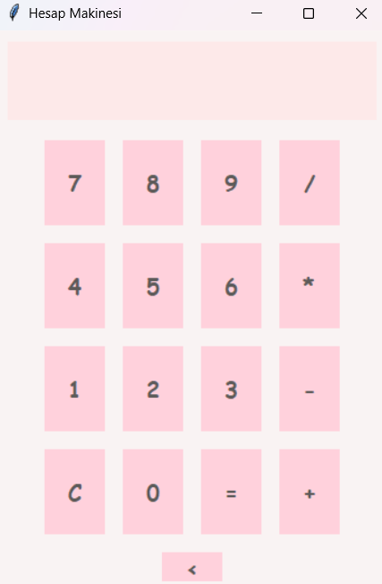

# Hesap Makinesi

Bu proje, Python ve Tkinter kullanılarak geliştirilmiş, sade ve modern bir tasarıma sahip bir masaüstü hesap makinesidir. Kullanıcılar yalnızca fare ile işlem yapabilir ve matematiksel işlemlerini kolaylıkla gerçekleştirebilir.

---

## Özellikler

- **Modern Tasarım**: Pastel renklerle sade bir arayüz.
- **Temel Matematiksel İşlemler**:
  - Toplama (`+`)
  - Çıkarma (`-`)
  - Çarpma (`*`)
  - Bölme (`/`)
  - Temizleme (`C`)
  - Geri Al (`<`)
- **Hata Yönetimi**: Geçersiz işlemlerde kullanıcıya "Hata" mesajı gösterir.

---

## Gereksinimler

- Python 3.7 veya üzeri
- Tkinter (Python ile birlikte gelir)

---

## Kurulum ve Çalıştırma

1. **Python'u yükleyin** (eğer yüklü değilse).
2. Bu proje dosyasını bilgisayarınıza indirin.
3. Terminal veya Komut İstemcisi'ni açarak dosyanın bulunduğu dizine gidin.
4. Aşağıdaki komutu çalıştırın:

   ```bash
   python hesap_makinesi.py
   ```

5. Hesap makinesi arayüzü açıldığında, fare ile işlemlerinizi yapabilirsiniz.

---


## Ekran Görüntüsü



---

<h1 align="center"> 𓍢ִ໋☕️✧˚ ༘ ⋆ </h1>

<h1> Contact Me🧑‍💻: </h1>

[](https://www.linkedin.com/in/elfgk/)
[](https://stackoverflow.com/users/27559679/elfgk)
[](https://huggingface.co/elfgk)
[](https://www.kaggle.com/elfgkk)


